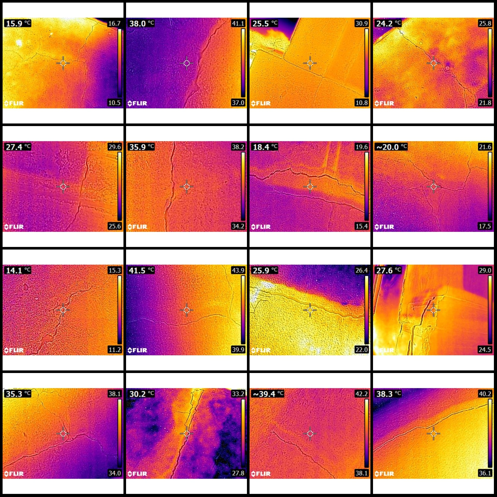
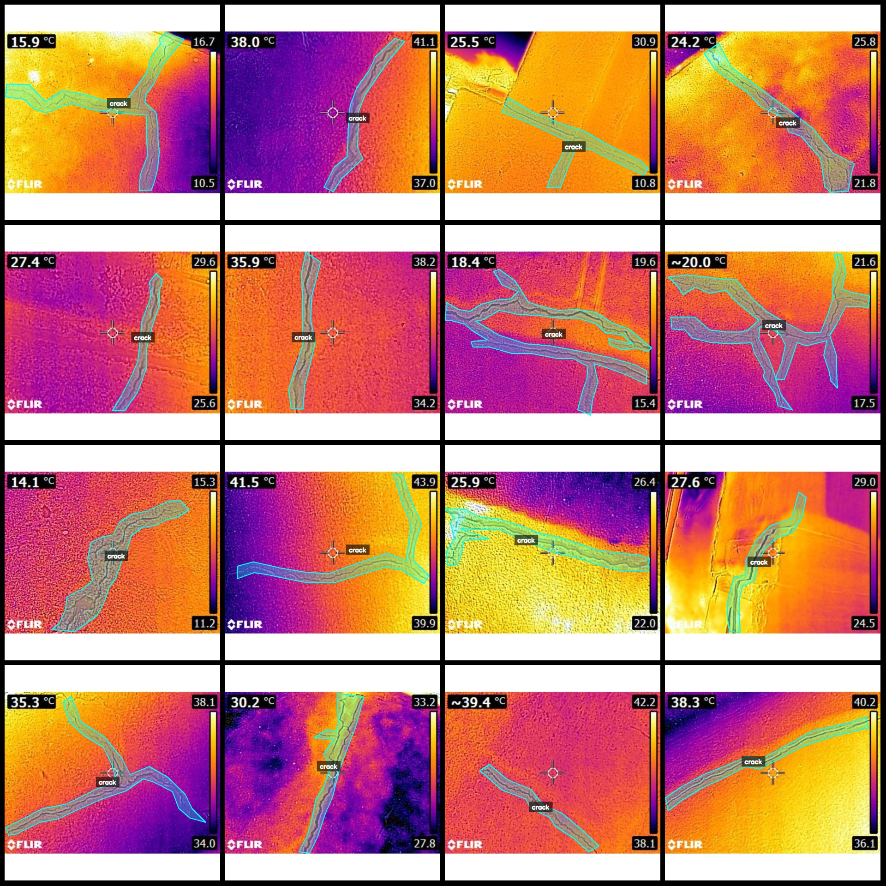
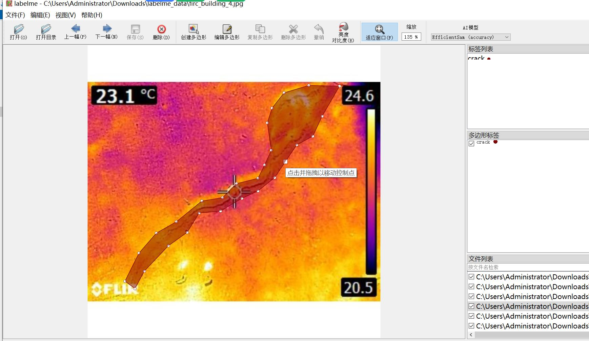

# Intelligent Building Infrared Thermal Imaging Wall Cracks Identification and Segmentation Dataset in LabelMe Format (700 Images, 1 Category)

Dataset Format: LabelMe format (without mask files, only containing jpg images and corresponding json files).
Number of Images (Number of jpg files): 700
Number of Annotations (Number of json files): 700
Number of Annotation Categories: 1
Annotation Category Name: "crack"
Number of Boxes per Category: 806
Total Boxes: 806
LabelMe Version: 5.5.0
Image Resolution: 640x640
Annotation Rules: Polygons for categories are drawn
Important Note: This dataset can be edited using LabelMe, but the json dataset needs to be converted into a mask or Yolo format or COCO format for semantic segmentation or instance segmentation.
Special Notice: This dataset does not guarantee the accuracy of the trained models or weight files.
Preview of Images:
Example of Annotation:
Annotation drawing results:
LabelMe editing example of images:

## Images

Here is a pay link on Stripe ( https://buy.stripe.com/3cs8yP7sY87d0vu9AB ). Please contact me lonlonago@foxmail.com after funding $89, and I will send you a complete data files , thank you!

